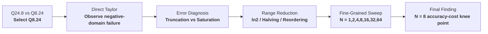
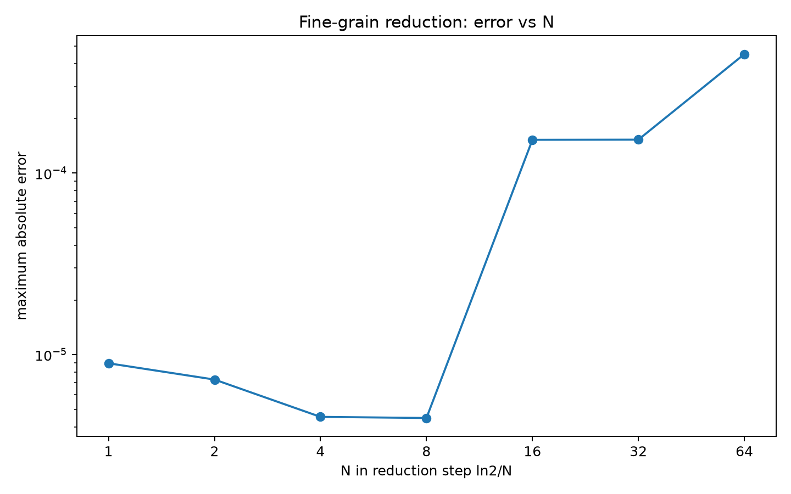
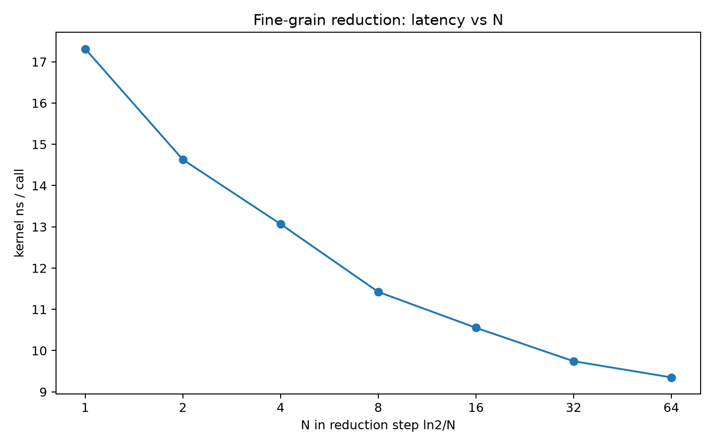
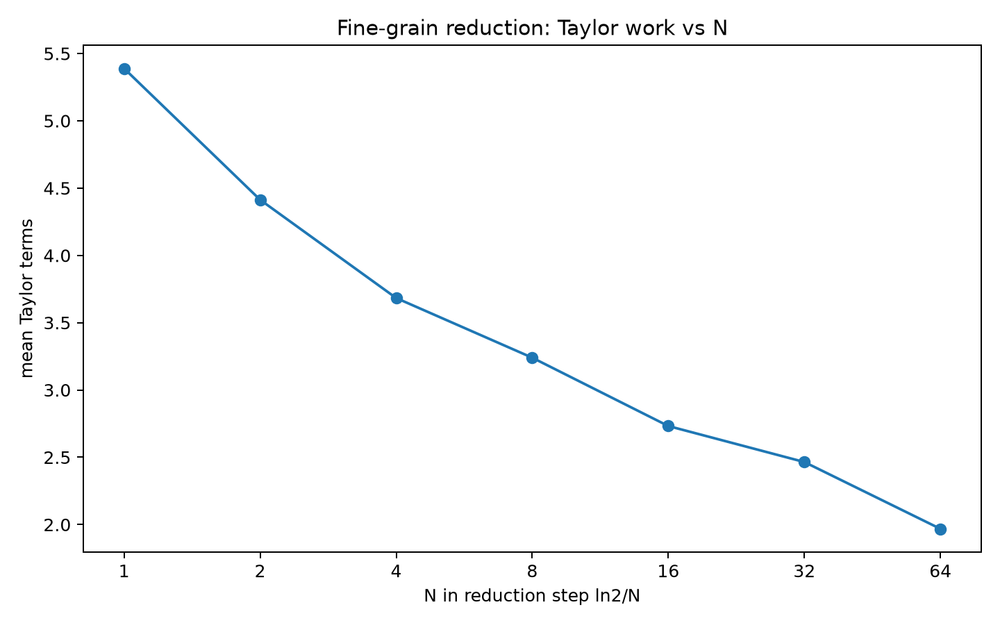
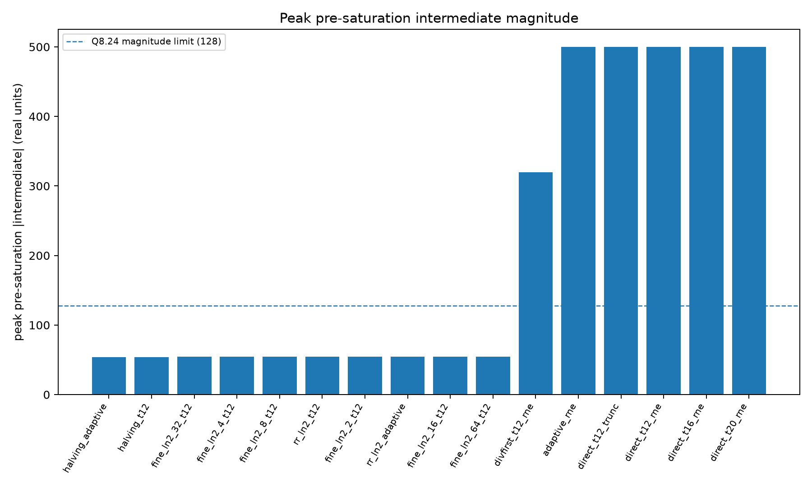
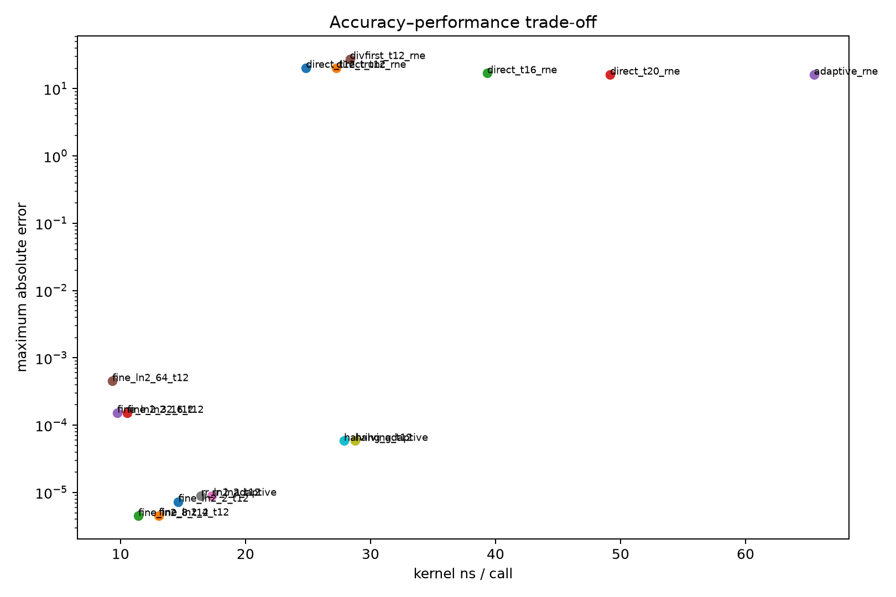
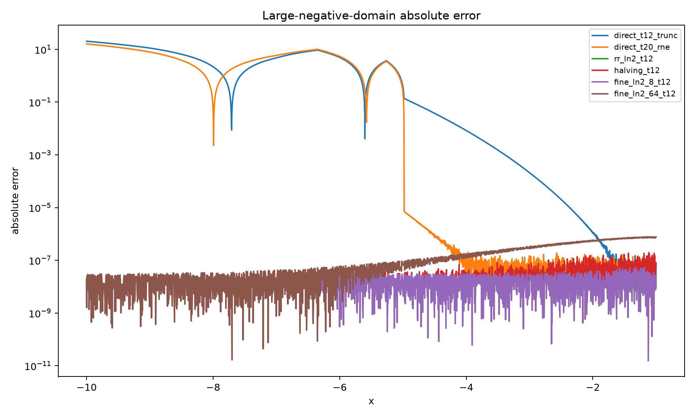

# Fixed-Point `expm1` Numerical Design-Space Exploration

A numerical systems study of how to compute `expm1(x) = e^x - 1` under a fixed 32-bit fixed-point representation.

The project began with a simple comparison between **Q24.8** and **Q8.24**, then evolved into a systematic exploration of approximation order, operation ordering, range reduction, intermediate saturation, reconstruction error, and performance.

The main research question is:

> **Under a fixed 32-bit Q8.24 representation, how should `expm1` be designed to balance numerical accuracy, intermediate-range robustness, and computational cost?**

---

## Overview



The study follows a research-driven progression: identify a numerical failure, isolate its dominant causes, introduce alternative designs, and evaluate each one using the same accuracy and performance framework.

---

## Key Findings

- **Increasing Taylor order alone is insufficient.**  
  Higher-order Taylor expansions reduce truncation error but leave the Q8.24 saturation problem essentially unchanged.

- **Operation ordering matters in finite precision.**  
  Replacing \((\text{term}\cdot x)/n\) with \((\text{term}/n)\cdot x\) reduces intermediate magnitude and saturation frequency, but increases quantization error.

- **Range reduction is the dominant improvement.**  
  Standard \(x=k\ln2+r\) reduction eliminates saturation and reduces error by several orders of magnitude.

- **Fine-grained reduction reduces Taylor workload further.**  
  Using \(x=k(\ln2/N)+r\) with increasing \(N\) reduces the average number of Taylor terms and improves runtime.

- **Finer reduction is not always better.**  
  For \(N\ge16\), the Taylor workload continues to decrease, but numerical error rises sharply. This is consistent with fixed-point quantization in the reduction constants and reconstruction path becoming a new limiting factor.

- **\(N=8\) is the clearest accuracy-cost knee point in the tested design space.**

- **Fixed-point arithmetic is not automatically faster than `libm`.**  
  On the tested modern CPU with hardware floating-point support, optimized `libm` remains faster than the best fixed-point kernel.

---

# 1. Phase 0 — Choosing the Fixed-Point Representation

The first experiment compared two signed 32-bit fixed-point formats:

- **Q24.8**
- **Q8.24**

Their fractional resolutions are:

$$
2^{-8}\approx3.91\times10^{-3}
$$

and

$$
2^{-24}\approx5.96\times10^{-8}.
$$

On the initial \([0,1]\) experiment:

- Q24.8 maximum absolute error: approximately \(1.88\times10^{-2}\)
- Q8.24 maximum absolute error: approximately \(4.77\times10^{-7}\)

The much finer fractional resolution of Q8.24 motivated its use for the remainder of the study.

The original Q24.8 / Q8.24 implementation, plots, and CSV results are preserved in:

```text
experiments/00_q24_vs_q8_baseline/
```

---

# 2. Phase 1 — Direct Q8.24 Taylor Approximation
The initial Q8.24 implementation directly evaluates the Taylor series:

`expm1(x) = x + x²/2! + x³/3! + ...`

without range reduction.

Near zero, the method behaves well. However, extending the experiment to negative inputs revealed severe failure for large \(|x|\).

For the direct 12-term Taylor baseline:

| Metric | Result |
|---|---:|
| Maximum absolute error | `20.4193` |
| Saturation-point rate | `35.84%` |
| Mean Taylor terms | `11.28` |
| Peak pre-saturation intermediate magnitude | `500` |
| Kernel latency | `24.84 ns/call` |

The Q8.24 representable range is approximately

$$
[-128,128).
$$

Therefore, a pre-saturation intermediate magnitude of 500 indicates that the direct recurrence can exceed the available range long before the final value itself becomes problematic.

---

# 3. Phase 2 — Error Diagnosis

The next experiments were designed to distinguish three different failure sources:

1. **Taylor truncation error**
2. **Fixed-point quantization error**
3. **Intermediate overflow / saturation**

## 3.1 Higher-Order Taylor Expansion

Increasing the Taylor order from 12 to 16 and 20 terms reduces approximation error, but does not change the saturation-point rate.

| Method | Max Abs. Error | Saturation Rate | Mean Terms | Kernel Latency |
|---|---:|---:|---:|---:|
| Direct T12 | 20.4193 | 35.84% | 11.28 | 24.84 ns |
| Direct T16 | 16.9561 | 35.84% | 14.26 | 39.34 ns |
| Direct T20 | 16.1848 | 35.84% | 16.53 | 49.17 ns |
| Adaptive Taylor | 16.1225 | 35.84% | 20.25 | 65.48 ns |

This shows that adding approximation work cannot solve a range problem.

## 3.2 Operation Reordering

The original recurrence

$$
\frac{\text{term}\cdot x}{n}
$$

was compared with

$$
\left(\frac{\text{term}}{n}\right)x.
$$

The divide-first form reduced:

- saturation-point rate from **35.84%** to **23.43%**
- peak pre-saturation intermediate magnitude from **500** to **320**

but increased maximum absolute error to **27.5875.**


This demonstrates a finite-precision trade-off:

> **Mathematically equivalent expressions are not numerically equivalent under fixed-point arithmetic.**

Multiplying first increases range pressure, while dividing first introduces quantization earlier in the computation.

---

# 4. Phase 3 — Standard `ln(2)` Range Reduction

A standard logarithmic range reduction was then introduced:

$$
x=k\ln2+r.
$$

The Taylor approximation is evaluated only on the smaller residual \(r\), followed by reconstruction.

This completely changes the numerical behavior:

| Method | Max Abs. Error | Saturation Rate | Mean Terms | Kernel Latency |
|---|---:|---:|---:|---:|
| Direct T12 | 20.4193 | 35.84% | 11.28 | 24.84 ns |
| `ln2` reduction | \(8.96\times10^{-6}\) | 0% | 5.39 | 17.31 ns |

The improvement is important for two reasons:

1. **Accuracy improves by several orders of magnitude.**
2. **Runtime also improves because the reduced domain requires fewer Taylor terms.**

Range reduction is therefore not only an accuracy technique; it also reduces computational work.

---

# 5. Phase 4 — Repeated-Halving Reduction

A shift-friendly alternative was also evaluated.

The input is repeatedly reduced:

`x -> x / 2^m`

and reconstructed using:

`expm1(2z) = 2 * expm1(z) + expm1(z)^2`
Results:

| Metric | Repeated Halving |
|---|---:|
| Maximum absolute error | \(5.85\times10^{-5}\) |
| Saturation-point rate | 0% |
| Mean Taylor terms | 6.97 |
| Kernel latency | 28.77 ns/call |

Repeated halving successfully controls the intermediate range, but repeated nonlinear reconstruction introduces additional multiplication cost and accumulated rounding error.

It is therefore a valid fixed-point-oriented alternative, but it does not outperform the `ln2` reduction baseline in the tested domain.

---

# 6. Phase 5 — Fine-Grained `ln(2)/N` Range Reduction

The final design-space sweep generalizes the reduction to

$$
x=k\frac{\ln2}{N}+r,
$$

with

$$
N\in\{1,2,4,8,16,32,64\}.
$$

The goal is to study the trade-off between:

- residual-domain size,
- Taylor workload,
- fixed-point quantization,
- reconstruction error,
- and runtime.

## Final Sweep

| \(N\) | Max Abs. Error | Mean Abs. Error | Mean Taylor Terms | Kernel ns/call | E2E ns/call |
|---:|---:|---:|---:|---:|---:|
| 1 | \(8.959\times10^{-6}\) | \(1.557\times10^{-7}\) | 5.39 | 17.31 | 26.03 |
| 2 | \(7.288\times10^{-6}\) | \(1.349\times10^{-7}\) | 4.41 | 14.63 | 22.52 |
| 4 | \(4.540\times10^{-6}\) | \(1.394\times10^{-7}\) | 3.68 | 13.07 | 19.88 |
| **8** | **\(4.476\times10^{-6}\)** | **\(1.276\times10^{-7}\)** | **3.24** | **11.42** | **18.61** |
| 16 | \(1.525\times10^{-4}\) | \(8.176\times10^{-6}\) | 2.73 | 10.55 | 17.97 |
| 32 | \(1.528\times10^{-4}\) | \(8.141\times10^{-6}\) | 2.46 | 9.74 | 16.20 |
| 64 | \(4.523\times10^{-4}\) | \(2.447\times10^{-5}\) | 1.97 | 9.35 | 15.01 |

All tested fine-grained reduction methods have:

$$
\text{saturation-point rate}=0.
$$

## Interpretation

From \(N=1\) to \(N=8\):

- maximum error decreases,
- mean Taylor terms decrease,
- kernel latency decreases.

For \(N\ge16\):

- Taylor workload continues to decrease,
- runtime continues to improve slightly,
- but numerical error rises sharply.

The trend is consistent with a new bottleneck emerging from fixed-point quantization in the increasingly fine reduction constants and reconstruction path.

Within the tested design space:

$$
\boxed{N=8}
$$

provides the clearest **accuracy-cost knee point**.

---

# 7. Performance Against `libm`

The project also compares the fixed-point kernels against the platform's optimized `libm` implementation.

Representative final timing:

| Method | Kernel Latency |
|---|---:|
| `libm expm1f()` | ~8.20 ns/call |
| Fine `ln2/8` | 11.42 ns/call |
| Standard `ln2` | 17.31 ns/call |
| Direct T12 | 24.84 ns/call |

The result is intentionally not framed as a fixed-point speedup claim.

On a modern CPU with hardware floating-point support and a highly optimized math library, `libm` remains faster.

The value of this study is instead in understanding how fixed-point numerical methods behave when:

- floating-point support is limited or undesirable,
- intermediate range is constrained,
- deterministic integer arithmetic is important,
- or implementation-level control over numerical error is required.

---

# 8. Visual Results

## Fine-Grained Maximum Error



The error improves up to \(N=8\), then rises sharply for finer reductions.

## Fine-Grained Kernel Latency



Increasing \(N\) reduces the approximation workload and generally lowers kernel latency.

## Mean Taylor Terms



The average number of evaluated Taylor terms decreases as the residual interval becomes smaller.

## Intermediate Range



Direct Taylor methods generate intermediates well beyond the Q8.24 range, while range-reduced methods keep intermediate magnitude under control.

## Accuracy vs Performance



This plot summarizes the overall numerical-accuracy and runtime trade-off among the tested methods.

## Negative-Domain Error



The negative-domain comparison highlights the failure of direct Taylor evaluation and the stability gained from range reduction.

---

# 9. Experimental Methodology

The final formal benchmark uses:

```text
Input domain:      x ∈ [-10, 4]
Accuracy step:     0.001
Timing rounds:     7
Samples / round:   4096
Repeats / sample:  1500
perf repetitions:  5
```

The build uses:

```text
-O3 -march=native -flto
```

Two timing scopes are reported:

### Kernel timing

Measures the numerical kernel itself.

### End-to-end timing

Includes:

- floating-point input conversion to Q8.24,
- numerical computation,
- conversion back to floating point.

Hardware counters are also collected with Linux `perf`, including:

- cycles
- instructions
- branches
- branch misses
- cache references
- cache misses

---

# 10. Repository Structure

```text
.
├── README.md
├── Makefile
├── requirements.txt
│
├── include/
│   └── expm1_fixed.h
│
├── src/
│   ├── expm1_fixed.c
│   ├── accuracy.c
│   └── bench_perf.c
│
├── scripts/
│   ├── run_all.sh
│   ├── run_timing.sh
│   ├── run_perf.sh
│   ├── analyze.py
│   ├── parse_perf.py
│   ├── generate_constants.py
│   └── save_environment.sh
│
├── results/
│   ├── accuracy.csv
│   ├── timing.csv
│   ├── summary.csv
│   ├── region_summary.csv
│   ├── timing_summary.csv
│   ├── perf_summary.csv
│   ├── fine_grain_sweep.csv
│   ├── summary.md
│   ├── findings.md
│   └── perf/
│
├── plots/
│   ├── abs_error_vs_x.png
│   ├── accuracy_vs_performance.png
│   ├── fine_grain_latency_vs_N.png
│   ├── fine_grain_max_error_vs_N.png
│   ├── fine_grain_terms_vs_N.png
│   ├── max_intermediate.png
│   ├── near_zero_abs_error.png
│   └── negative_domain_abs_error.png
│
└── experiments/
    ├── 00_q24_vs_q8_baseline/
    ├── 01_quick_baseline/
    ├── 02_formal_N1_to_N8/
    └── 03_quick_N1_to_N64/
```

The `experiments/` directory preserves the evolution of the study rather than only keeping the final selected result.

---

# 11. Implemented Methods

The benchmark currently includes:

```text
libm
direct_t12_trunc
direct_t12_rne
direct_t16_rne
direct_t20_rne
adaptive_rne
divfirst_t12_rne
rr_ln2_t12
rr_ln2_adaptive
halving_t12
halving_adaptive
fine_ln2_2_t12
fine_ln2_4_t12
fine_ln2_8_t12
fine_ln2_16_t12
fine_ln2_32_t12
fine_ln2_64_t12
```

---

# 12. Build and Run

## Requirements

On Ubuntu:

```bash
sudo apt update
sudo apt install build-essential python3 python3-pip python3-venv linux-tools-common linux-tools-$(uname -r)
```

Create a Python virtual environment:

```bash
python3 -m venv .venv
source .venv/bin/activate
pip install -r requirements.txt
```

## Build

```bash
make -j
```

## List Available Methods

```bash
./bin/bench_perf --list
```

## Accuracy Smoke Test

```bash
./bin/accuracy \
  --method fine_ln2_8_t12 \
  --xmin -1 \
  --xmax 1 \
  --step 0.5
```

## Quick Experiment

```bash
STEP=0.01 \
ROUNDS=3 \
REPEATS=200 \
SAMPLES=1024 \
./scripts/run_all.sh
```

## Formal Experiment

```bash
RUN_PERF=1 \
STEP=0.001 \
ROUNDS=7 \
REPEATS=1500 \
SAMPLES=4096 \
PERF_REPEATS=5 \
./scripts/run_all.sh
```

Main outputs are written to:

```text
results/
plots/
```

---

# 13. Research Takeaways

This project changed from a fixed-point implementation exercise into a numerical design-space study.

The most important lesson is that fixed-point numerical design cannot be evaluated from approximation error alone.

A robust implementation must consider:

$$
\text{Approximation Error}
+
\text{Quantization Error}
+
\text{Intermediate Range}
+
\text{Reconstruction Error}
+
\text{Computational Cost}.
$$

The experiments show that improving one dimension can expose a different bottleneck:

- higher Taylor order reduces truncation but not saturation,
- operation reordering reduces range pressure but increases quantization,
- range reduction solves saturation,
- finer reduction reduces Taylor work,
- overly fine reduction eventually increases numerical error.

The final result is therefore not a single universally optimal implementation, but a measured understanding of the **accuracy–range–performance trade-off** under a fixed Q8.24 representation.

---

## Historical Baseline

The original Q24.8 / Q8.24 experiment is preserved in:

```text
experiments/00_q24_vs_q8_baseline/
```

The original repository state is also retained through the Git references:

```text
v1-baseline
archive/baseline
```

This makes the progression from the initial fixed-point experiment to the final design-space study reproducible and inspectable.
